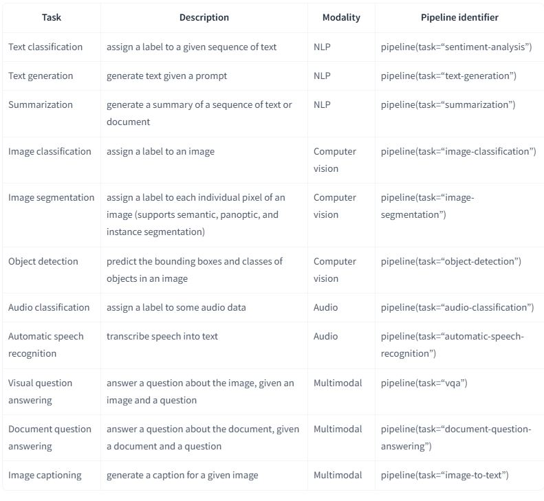

# README

## HF Transformers Implementation

This project demonstrates various Natural Language Processing (NLP) and Image Processing tasks using Hugging Face Transformers. It includes text classification, named entity recognition, question answering, text summarization, translation, text generation, and image classification.

[Hugging Face Transformers Quicktour](https://huggingface.co/docs/transformers/v4.35.0/en/quicktour#pipeline)


---

## Installation
Ensure you have Python installed along with the required libraries:

```sh
pip install transformers pandas pillow requests
```

---

## Implementation Details

### 1. Text Classification
Classifies text sentiment using a pre-trained model.
[SamLowe/roberta-base-go_emotions](https://huggingface.co/SamLowe/roberta-base-go_emotions)

```python
from transformers import pipeline
import pandas as pd

classifier = pipeline("text-classification", model="SamLowe/roberta-base-go_emotions")
text = "wow! we have come across this far"
outputs = classifier(text)
print("result-> ", pd.DataFrame(outputs))
```
**Expected Output:**
A dataframe with the predicted emotion label and confidence score.
``` sh
      label     score
0  surprise  0.630752
```
---

### 2. Named Entity Recognition (NER)
Extracts key phrases from a given text.
```python
ner_tagger = pipeline("ner", aggregation_strategy="simple", model="ml6team/keyphrase-extraction-kbir-inspec")
text = "Keyphrase extraction is a technique in text analysis where you extract the important keyphrases from a document."
outputs = ner_tagger(text)
print("result-> ", pd.DataFrame(outputs))
```
**Expected Output:**
A dataframe listing extracted keyphrases and their scores.
```sh
  entity_group     score                   word  start  end
0          KEY  0.999997   Keyphrase extraction      0   20
1          KEY  0.999993          text analysis     39   52
```
---

### 3. Question Answering
Extracts answers from a given context.
```python
reader = pipeline("question-answering")
text = "Dear Amazon, last week I ordered an Optimus Prime action figure from your online store in India."
question = "from where did I place order?"
outputs = reader(question=question, context=text)
print("result-> ", pd.DataFrame([outputs]))
```
**Expected Output:**
A dataframe with the extracted answer ("India") and confidence score.
```sh
      score  start  end                 answer
0  0.311888     75   96  online store in India
```
---

### 4. Text Summarization
Summarizes a given text.
```python
summarizer = pipeline("summarization")
outputs = summarizer(text)
print("summarize-> ", outputs)
```
**Expected Output:**
A summarized version of the input text.

---

### 5. Translation (English to German)
Translates English text into German.
```python
translator = pipeline("translation_en_to_de", model="Helsinki-NLP/opus-mt-en-de")
outputs = translator(text)
print("translate-> ", outputs)
```
**Expected Output:**
German translation of the input text.

---

### 6. Text Generation
Generates text based on a given prompt.
```python
from transformers import set_seed
set_seed(0)
generator = pipeline("text-generation", model="gpt2-large")
prompt = "There was a lion "
outputs = generator(prompt, max_length=128)
```
**Expected Output:**
A generated story continuing the prompt.
```sh
[{'generated_text': 'There was a lion \xa0(Sudurus rex), a bear ( Ursus americanus ), a cougar\xa0 (Panthera onca ):\nThe second lion was apparently a\xa0 ( Acrocanthosaurus ), but that animal was clearly a subadult male of the\xa0 ( Acrocanthosaurus ) genus and was not clearly a male at all. For some reason people believed that I had photographed a male lion, one of whose most typical characteristics would be one\xa0 which is\xa0 very long and is a bit more heavily muscled. This lion\xa0 (Acrocanthosaurus) was about 40m'}]
```
---

### 7. Image Classification
Classifies an image using a pre-trained model.
```python
from PIL import Image
import requests

url = "https://res.cloudinary.com/dk-find-out/image/upload/q_80,w_1920,f_auto/DCTM_Penguin_UK_DK_AL697473_RGB_PNG_namnse.jpg"
image = Image.open(requests.get(url, stream=True).raw)
classifier = pipeline("image-classification")
outputs = classifier(image)
print(outputs)
```
**Expected Output:**
A list of predicted labels with confidence scores.
```sh
[{'label': 'Egyptian cat', 'score': 0.9214929938316345}, {'label': 'tabby, tabby cat', 'score': 0.058183521032333374}, {'label': 'tiger cat', 'score': 0.012602909468114376}, {'label': 'lynx, catamount', 'score': 0.0037158718332648277}, {'label': 'Siamese cat, Siamese', 'score': 0.00039997967542149127}]
```

### 8.  Image segmentation 
```python
url = "https://img.freepik.com/free-photo/young-bearded-man-with-striped-shirt_273609-5677.jpg"
image = Image.open(requests.get(url, stream=True).raw)
segmenter = pipeline("image-segmentation", model="mattmdjaga/segformer_b2_clothes")
outputs = segmenter(image)
```
**Expected Output:**
A list of predicted labels with confidence scores.
```sh
  score          label                                               mask
0  None     Background  <PIL.Image.Image image mode=L size=626x417 at ...
1  None           Hair  <PIL.Image.Image image mode=L size=626x417 at ...
2  None  Upper-clothes  <PIL.Image.Image image mode=L size=626x417 at ...
3  None           Face  <PIL.Image.Image image mode=L size=626x417 at ...
```
