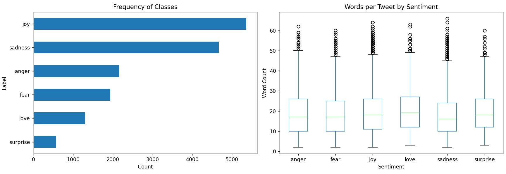
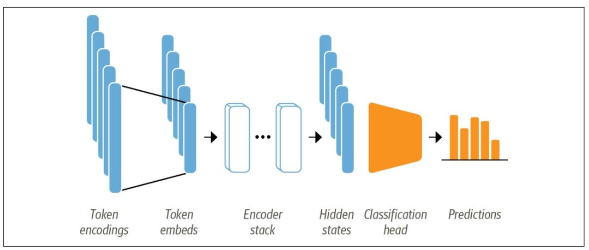

# Sentiment Classification using Transformers

This project performs sentiment classification using transformer models, specifically leveraging BERT (`bert-base-uncased`). The dataset consists of tweets labeled with sentiment categories, and we will walk through each step from loading data to preparing the model.
This project fine-tunes a **BERT-based model** for sentiment classification. The model classifies text into different sentiment categories using the **Hugging Face `transformers` library**.

## Installation

Before running the script, ensure you have the required Python libraries installed. You can do this by running:

```bash
pip install pandas matplotlib transformers datasets scikit-learn torch
```

## Steps to Run the Code

### 1. Load and Analyze Data

The dataset used in this project is stored as a CSV file. We first load it into a Pandas DataFrame:

```python
import pandas as pd
import matplotlib.pyplot as plt

df = pd.read_csv("assets/twitter_sentiment.csv")
```

#### Data Exploration

To understand the structure of the dataset, we can check its information:

```python
print(df.info())  # Displays the number of rows, columns, and data types
print(df.isnull().sum())  # Checks for missing values in each column
print(df['label'].value_counts())  # Shows the count of each sentiment category
```

### 2. Visualizing Data

To gain insights into the data distribution, we create plots for class frequency and word count per tweet.

#### Plot Class Distribution

```python
label_counts = df['label_name'].value_counts(ascending=True)
fig, axes = plt.subplots(1, 2, figsize=(14, 5))
label_counts.plot.barh(ax=axes[0])  # Horizontal bar plot
axes[0].set_title("Frequency of Classes")
axes[0].set_xlabel("Count")
axes[0].set_ylabel("Label")
```

#### Plot Word Count Distribution

We calculate the number of words per tweet and create a box plot:

```python
df['Words per Tweet'] = df['text'].str.split().apply(len)
df.boxplot(column="Words per Tweet", by="label_name", ax=axes[1], grid=False)
axes[1].set_title("Words per Tweet by Sentiment")
axes[1].set_xlabel("Sentiment")
axes[1].set_ylabel("Word Count")

plt.suptitle("")  # Remove automatic title
plt.tight_layout()
plt.show()
```


### 3. Tokenization

- Transformer models like BERT cannot receive raw strings as input; instead, they assume the text has been tokenized and encoded as numerical vectors.
- Tokenization is the step of breaking down a string into the atomic units used in the model




Transformer models like BERT cannot process raw text directly. Instead, text must be tokenized and converted into numerical vectors. We use the BERT tokenizer for this:


```python
model_ckpt = "bert-base-uncased"
tokenizer = AutoTokenizer.from_pretrained(model_ckpt)
```

To see how tokenization works, let’s tokenize an example sentence:

**Encoded text**
```python
text = "I love machine learning! Tokenization is awesome!!"
encoded_text = tokenizer(text)
print(encoded_text)  # Tokenized representation of text
```

```sh 
{'input_ids': [101, 1045, 2293, 3698, 4083, 999, 19204, 3989, 2003, 12476, 999, 999, 102], 'token_type_ids': [0, 0, 0, 0, 0, 0, 0, 0, 0, 0, 0, 0, 0], 'attention_mask': [1, 1, 1, 1, 1, 1, 1, 1, 1, 1, 1, 1, 1]}
```
**Inputs IDs**
```python
input_ids = tokenizer(text, return_tensors='pt').input_ids  
print('input_id: ', input_ids)  
```


```sh 
input_id:  tensor([[  101,  1045,  2293,  3698,  4083,   999, 19204,  3989,  2003, 12476,
           999,   999,   102]])
```
### 4. Splitting Data and Creating Dataset

To train the model, we split the dataset into training, validation, and testing sets:

```python
train, test = train_test_split(df, test_size=0.3, stratify=df['label_name'])
test, validation = train_test_split(test, test_size=1/3, stratify=test['label_name'])
```

We then convert these into the Hugging Face `DatasetDict` format:

```python
dataset = DatasetDict({
    'train': Dataset.from_pandas(train, preserve_index=False),
    'test': Dataset.from_pandas(test, preserve_index=False),
    'validation': Dataset.from_pandas(validation, preserve_index=False)
})
```

**Ouput:**
```sh
DatasetDict({
    train: Dataset({
        features: ['text', 'label', 'label_name', 'Words per Tweet'],
        num_rows: 11200
    })
    test: Dataset({
        features: ['text', 'label', 'label_name', 'Words per Tweet'],
        num_rows: 3200
    })
    validation: Dataset({
        features: ['text', 'label', 'label_name', 'Words per Tweet'],
        num_rows: 1600
    })
})
```
**First print**
```python
pprint(dataset['train'][0])
```

```sh
{'Words per Tweet': 9,
 'label': 1,
 'label_name': 'joy',
 'text': 'i think we ll feel pretty good about that'}
```
**Second print**
```python
pprint(dataset['train'][1])
```

```sh
{'Words per Tweet': 32,
 'label': 3,
 'label_name': 'anger',
 'text': 'i feel like i m so distracted by silly things like twitter that i '
         'can spend an entire evening with the kids and not actually hear a '
         'thing that they re saying'}
 'text': 'i feel like i m so distracted by silly things like twitter that i '
         'can spend an entire evening with the kids and not actually hear a '
         'thing that they re saying'}
```

Next, we apply **tokenization** to the dataset:

```python
def tokenize(batch):
    return tokenizer(batch['text'], padding=True, truncation=True)

dataset = dataset.map(tokenize, batched=True, batch_size=None)
```

```sh
{'Words per Tweet': 9,
 'attention_mask': [1,1,1,1,1,1,.....1,1,1,1,1,1,...,0,0,0,0,0,0],
 'input_ids': [101,1045,10214,2000,2994,1999,2023,2173,....0,0,0,0,0,0],
 'label': 1,
 'label_name': 'joy',
 'text': 'i think we ll feel pretty good about that',
 'token_type_ids': [0,0,0,0,0,0,.......,0,0,0]}

```


### 5. Mapping Labels

Since machine learning models work with numerical labels, we create mappings:

**Dictionary mapping label names to numerical IDs**
- The resulting dictionary maps sentiment names to numerical IDs. 
```python
label2id = {x['label_name']: x['label'] for x in dataset['train']}
print(label2id)   
```
Output:

```sh
{'sadness': 0, 'joy': 1, 'surprise': 5, 'anger': 3, 'love': 2, 'fear': 4}
```
**Reverse mapping from IDs to labels**
- The new dictionary maps numerical IDs back to sentiment labels.

```python
id2label = {v: k for k, v in label2id.items()}
print(id2label)  
```
Ouput: 
```sh
{0: 'sadness', 1: 'joy', 5: 'surprise', 3: 'anger', 2: 'love', 4: 'fear'}
Some weights of BertForSequenceClassification were not initialized from the model checkpoint at bert-base-uncased and are newly initialized: ['classifier.bias', 'classifier.weight']
```
---

### 6. Model building

- Loads a **pretrained BERT model**.
- Retrieves **id-to-label mapping** to check sentiment classes.


```python
model = AutoModel.from_pretrained(model_ckpt)
model.config.id2label  # Retrieve label mapping
model.config  # View model configuration
```
**Output**

```sh
BertConfig {
  "_attn_implementation_autoset": true,
  "architectures": [
    "BertForMaskedLM"
  ],
  "attention_probs_dropout_prob": 0.1,
  "classifier_dropout": null,
  "gradient_checkpointing": false,
  "hidden_act": "gelu",
  "hidden_dropout_prob": 0.1,
  "hidden_size": 768,
  "initializer_range": 0.02,
  "intermediate_size": 3072,
  "layer_norm_eps": 1e-12,
  "max_position_embeddings": 512,
  "model_type": "bert",
  "num_attention_heads": 12,
  "num_hidden_layers": 12,
  "pad_token_id": 0,
  "position_embedding_type": "absolute",
  "torch_dtype": "float32",
  "transformers_version": "4.50.1",
  "type_vocab_size": 2,
  "use_cache": true,
  "vocab_size": 30522
}
```

---

## **7. Fine-Tuning the Transformer Model**
```python

num_labels = len(label2id)
device = torch.device("cuda" if torch.cuda.is_available() else "cpu")
config = AutoConfig.from_pretrained(model_ckpt, label2id=label2id, id2label=id2label)
model = AutoModelForSequenceClassification.from_pretrained(model_ckpt, config=config).to(device)
pprint(model.config)
```
- Configures the model with **custom label mappings**.
- Moves the model to **GPU (if available)** for faster training.

---

## **8. Setting Training Arguments**
```python
batch_size = 64
training_dir = "bert_base_train_dir"

training_args = TrainingArguments(
    output_dir=training_dir,
    overwrite_output_dir=True,
    num_train_epochs=2,
    learning_rate=2e-5,
    per_device_train_batch_size=batch_size,
    per_device_eval_batch_size=batch_size,
    weight_decay=0.01,
    evaluation_strategy='epoch',
    di
```


## **9. Building the Trainer**
```python
trainer = Trainer(
    model=model,
    args=training_args,
    compute_metrics=compute_metrics,
    train_dataset=emotion_encoded['train'],
    eval_dataset=emotion_encoded['validation'],
    tokenizer=tokenizer
)
print(trainer.train())
```
- Initializes **Hugging Face's Trainer** for supervised training.
- **Fine-tunes** the model using training and validation datasets.

---

## **10. Model Evaluation**
```python
preds_output = trainer.predict(emotion_encoded['test'])
preds_output.metrics
```
- Evaluates the model on the **test dataset**.
- **Generates accuracy metrics**.

#### **Extract Predictions and Compare with True Labels**
```python
y_pred = np.argmax(preds_output.predictions, axis=1)
y_true = emotion_encoded['test'][:]['label']

print(classification_report(y_true, y_pred))
print(label2id)
```
- Converts **model logits** into class predictions.
- Prints a **classification report** (precision, recall, F1-score).

#### **Confusion Matrix for Performance Visualization**
```python
cm = confusion_matrix(y_true, y_pred)

plt.figure(figsize=(5,5))
sns.heatmap(cm, annot=True, xticklabels=label2id.keys(), yticklabels=label2id.keys(), fmt='d', cbar=False, cmap='Reds')
plt.ylabel("Actual")
plt.xlabel("Predicted")
plt.show()
```
- Generates a **confusion matrix** to visualize predictions.

---

## **11. Saving the Model and Making Predictions**
```python
text = "I am super happy today. I got it done. Finally!!"
get_prediction(text)
trainer.save_model("bert-base-uncased-sentiment-model")
```
- Saves the **fine-tuned BERT model**.
- Uses `get_prediction()` to classify a sample sentence.

---

## **12. Loading the Model for Inference**
```python
classifier = pipeline('text-classification', model='bert-base-uncased-sentiment-model')
classifier([text, 'hello, how are you?', "love you", "i am feeling low"])
```
- Loads the **saved model** for text classification.
- **Predicts sentiment** for multiple text inputs.

---

## **Summary**
This script fine-tunes a **BERT-based model** for **sentiment classification** using:
1. **Pretrained BERT Model** (`bert-base-uncased`)
2. **Training with Optimized Hyperparameters**
3. **Evaluation using Accuracy & Confusion Matrix**
4. **Saving & Deploying the Model for Predictions**


