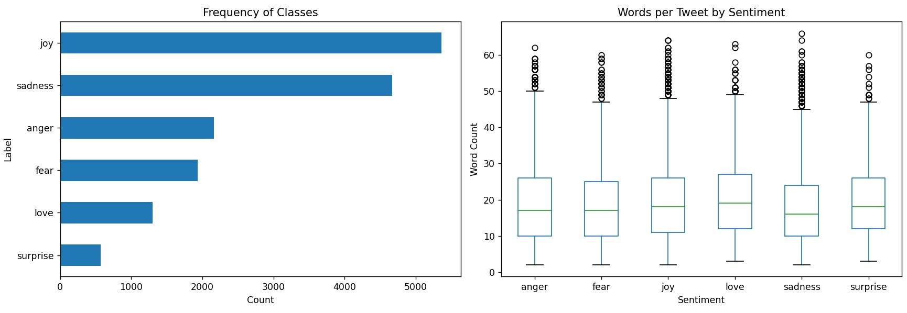
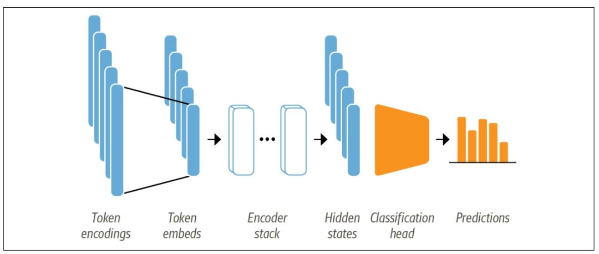
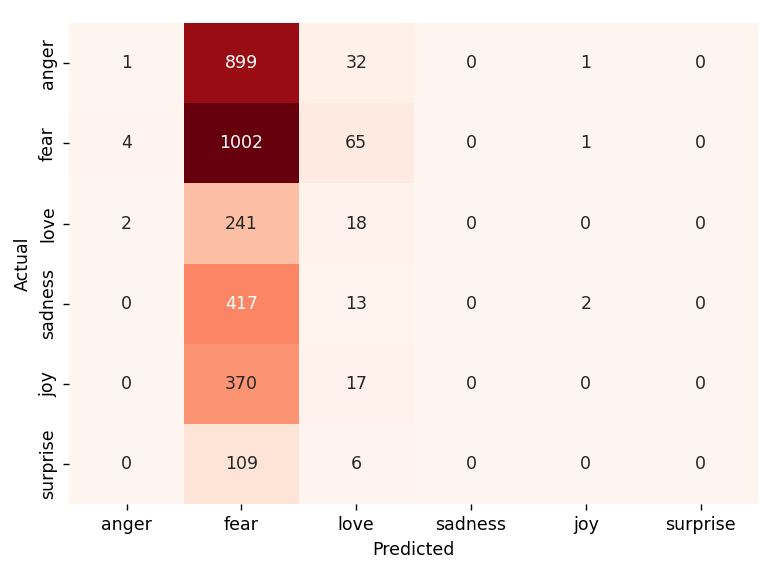

# Sentiment Classification using Transformers

This project performs sentiment classification using transformer models, specifically leveraging BERT (`bert-base-uncased`). The dataset consists of tweets labeled with sentiment categories, and we will walk through each step from loading data to preparing the model.
This project fine-tunes a **BERT-based model** for sentiment classification. The model classifies text into different sentiment categories using the **Hugging Face `transformers` library**.

## Installation

Before running the script, ensure you have the required Python libraries installed. You can do this by running:

```bash
pip install pandas matplotlib transformers datasets scikit-learn torch
```

## Implementation

### 1. Load and Analyze Data

The dataset used in this project is stored as a CSV file. We first load it into a Pandas DataFrame:

```python
df = pd.read_csv("assets/twitter_sentiment.csv")
```

#### Data Exploration

To understand the structure of the dataset, we can check its information:

```python
print(df.info())  # Displays the number of rows, columns, and data types
print(df.isnull().sum())  # Checks for missing values in each column
print(df['label'].value_counts())  # Shows the count of each sentiment category
```

#### Visualizing Data

To gain insights into the data distribution, we create plots for class frequency and word count per tweet.



### 2. Text to Tokens Conversion

- Transformer models like BERT cannot receive raw strings as input; instead, they assume the text has been tokenized and encoded as numerical vectors.
- Tokenization is the step of breaking down a string into the atomic units used in the model



Transformer models like BERT cannot process raw text directly. Instead, text must be tokenized and converted into numerical vectors. We use the BERT tokenizer for this:


```python
model_ckpt = "bert-base-uncased"
tokenizer = AutoTokenizer.from_pretrained(model_ckpt)
```

To see how tokenization works, let’s tokenize an example sentence:

**Encoded text**
```python
text = "I love machine learning! Tokenization is awesome!!"
encoded_text = tokenizer(text)
print(encoded_text)  # Tokenized representation of text
```

```sh 
{'input_ids': [101, 1045, 2293, 3698, 4083, 999, 19204, 3989, 2003, 12476, 999, 999, 102], 'token_type_ids': [0, 0, 0, 0, 0, 0, 0, 0, 0, 0, 0, 0, 0], 'attention_mask': [1, 1, 1, 1, 1, 1, 1, 1, 1, 1, 1, 1, 1]}
```
**Inputs IDs**
```python
input_ids = tokenizer(text, return_tensors='pt').input_ids  
print('input_id: ', input_ids)  
```


```sh 
input_id:  tensor([[  101,  1045,  2293,  3698,  4083,   999, 19204,  3989,  2003, 12476,
           999,   999,   102]])
```
### 3. Splitting Data and Creating Dataset

To train the model, we split the dataset into training, validation, and testing sets:

```python
train, test = train_test_split(df, test_size=0.3, stratify=df['label_name'])
test, validation = train_test_split(test, test_size=1/3, stratify=test['label_name'])
```

We then convert these into the Hugging Face `DatasetDict` format:

```python
dataset = DatasetDict({
    'train': Dataset.from_pandas(train, preserve_index=False),
    'test': Dataset.from_pandas(test, preserve_index=False),
    'validation': Dataset.from_pandas(validation, preserve_index=False)
})
```

**Ouput:**
```sh
DatasetDict({
    train: Dataset({
        features: ['text', 'label', 'label_name', 'Words per Tweet'],
        num_rows: 11200
    })
    test: Dataset({
        features: ['text', 'label', 'label_name', 'Words per Tweet'],
        num_rows: 3200
    })
    validation: Dataset({
        features: ['text', 'label', 'label_name', 'Words per Tweet'],
        num_rows: 1600
    })
})
```
**Dataset train**
```python
pprint(dataset['train'][0]), pprint(dataset['train'][1])
```

```sh
({'text': 'i feel im being generous with that statement',
  'label': 2,
  'label_name': 'love',
  'Words per Tweet': 8},
 {'text': 'i make them feel valued and included even when we don t see each other often that it s one of my superpowers',
  'label': 1,
  'label_name': 'joy',
  'Words per Tweet': 23})
```


#### **Tokenization** 

```python
def tokenize(batch):
    return tokenizer(batch['text'], padding=True, truncation=True)

dataset = dataset.map(tokenize, batched=True, batch_size=None)
```

```sh
{'Words per Tweet': 9,
 'attention_mask': [1,1,1,1,1,1,.....1,1,1,1,1,1,...,0,0,0,0,0,0],
 'input_ids': [101,1045,10214,2000,2994,1999,2023,2173,....0,0,0,0,0,0],
 'label': 1,
 'label_name': 'joy',
 'text': 'i think we ll feel pretty good about that',
 'token_type_ids': [0,0,0,0,0,0,.......,0,0,0]}

```


#### Mapping Labels

- Dictionary mapping label names to numerical IDs
- The resulting dictionary maps sentiment names to numerical IDs. 
```python
label2id = {x['label_name']: x['label'] for x in dataset['train']}
print(label2id)   
```
Output:

```sh
{'sadness': 0, 'joy': 1, 'surprise': 5, 'anger': 3, 'love': 2, 'fear': 4}
```
**Reverse mapping from IDs to labels**
- The new dictionary maps numerical IDs back to sentiment labels.

```python
id2label = {v: k for k, v in label2id.items()}
print(id2label)  
```
Ouput: 
```sh
{0: 'sadness', 1: 'joy', 5: 'surprise', 3: 'anger', 2: 'love', 4: 'fear'}
Some weights of BertForSequenceClassification were not initialized from the model checkpoint at bert-base-uncased and are newly initialized: ['classifier.bias', 'classifier.weight']
```
---

### 4. Model building

- Loads a **pretrained BERT model**.
- Retrieves **id-to-label mapping** to check sentiment classes.


```python
model = AutoModel.from_pretrained(model_ckpt)
model.config.id2label  # Retrieve label mapping
model.config  # View model configuration
```
**Output**

```sh
BertConfig {
  "_attn_implementation_autoset": true,
  "architectures": [
    "BertForMaskedLM"
  ],
  "attention_probs_dropout_prob": 0.1,
  "classifier_dropout": null,
  "gradient_checkpointing": false,
  "hidden_act": "gelu",
  "hidden_dropout_prob": 0.1,
  "hidden_size": 768,
  "initializer_range": 0.02,
  "intermediate_size": 3072,
  "layer_norm_eps": 1e-12,
  "max_position_embeddings": 512,
  "model_type": "bert",
  "num_attention_heads": 12,
  "num_hidden_layers": 12,
  "pad_token_id": 0,
  "position_embedding_type": "absolute",
  "torch_dtype": "float32",
  "transformers_version": "4.50.1",
  "type_vocab_size": 2,
  "use_cache": true,
  "vocab_size": 30522
}
```

---

## **5. Fine-Tuning the Transformer Model**

- Configures the model with **custom label mappings**.
- Moves the model to **GPU (if available)** for faster training.
- `AutoModelForSequenceClassification` model has a classification head on top of the pretrained model outputs
- The first thing we need is a pretrained BERT model like the one we used in the feature-based approach.
- The only slight modification is that we use the `AutoModelForSequenceClassification` model instead of AutoModel.
- The difference is that the `AutoModelForSequenceClassification` model has a classification head on top of the pretrained model outputs, which can be easily trained with the base model.

```python
num_labels = len(label2id)
device = torch.device("cuda" if torch.cuda.is_available() else "cpu")
config = AutoConfig.from_pretrained(model_ckpt, label2id=label2id, id2label=id2label)
model = AutoModelForSequenceClassification.from_pretrained(model_ckpt, config=config).to(device)
print(model)
```
- `config = AutoConfig.from_pretrained(model_ckpt, label2id=label2id, id2label=id2label)`

    - Loads the configuration for a pre-trained model from `model_ckpt`.

    - It customizes the configuration by specifying `label2id` (mapping labels to IDs) and `id2label` (mapping IDs back to labels).

    - This is useful for classification tasks, ensuring the model correctly associates outputs with labels.

- `model = AutoModelForSequenceClassification.from_pretrained(model_ckpt, config=config).to(device)`.

    - Loads a pre-trained model designed for sequence classification from `model_ckpt`.

    - Uses the previously defined `config` to ensure the model has the correct label mappings.

    - Moves the model to the appropriate device (`cuda` or `cpu`) for computation.
    
```sh
BertForSequenceClassification(
  (bert): BertModel(
    (embeddings): BertEmbeddings(
      (word_embeddings): Embedding(30522, 768, padding_idx=0)
      (position_embeddings): Embedding(512, 768)
      (token_type_embeddings): Embedding(2, 768)
      (LayerNorm): LayerNorm((768,), eps=1e-12, elementwise_affine=True)
      (dropout): Dropout(p=0.1, inplace=False)
    )
    (encoder): BertEncoder(
      (layer): ModuleList(
        (0-11): 12 x BertLayer(
          (attention): BertAttention(
            (self): BertSdpaSelfAttention(
              (query): Linear(in_features=768, out_features=768, bias=True)
              (key): Linear(in_features=768, out_features=768, bias=True)
              (value): Linear(in_features=768, out_features=768, bias=True)
              (dropout): Dropout(p=0.1, inplace=False)
            )
            (output): BertSelfOutput(
              (dense): Linear(in_features=768, out_features=768, bias=True)
              (LayerNorm): LayerNorm((768,), eps=1e-12, elementwise_affine=True)
              (dropout): Dropout(p=0.1, inplace=False)
            )
          )
          (intermediate): BertIntermediate(
            (dense): Linear(in_features=768, out_features=3072, bias=True)
            (intermediate_act_fn): GELUActivation()
          )
          (output): BertOutput(
            (dense): Linear(in_features=3072, out_features=768, bias=True)
            (LayerNorm): LayerNorm((768,), eps=1e-12, elementwise_affine=True)
            (dropout): Dropout(p=0.1, inplace=False)
          )
        )
      )
    )
    (pooler): BertPooler(
      (dense): Linear(in_features=768, out_features=768, bias=True)
      (activation): Tanh()
    )
  )
  (dropout): Dropout(p=0.1, inplace=False)
  (classifier): Linear(in_features=768, out_features=6, bias=True)
)
```
---

#### Setting Training Arguments and Building the Trainer
```python
batch_size = 64
training_dir = "bert_base_train_dir"

training_args = TrainingArguments(
    output_dir=training_dir,
    overwrite_output_dir=True,
    num_train_epochs=2,
    learning_rate=2e-5,
    per_device_train_batch_size=batch_size,
    per_device_eval_batch_size=batch_size,
    weight_decay=0.01,
    evaluation_strategy='epoch',
    di
```

**Building the Trainer**

- Initializes **Hugging Face's Trainer** for supervised training.
- **Fine-tunes** the model using training and validation datasets.

```python
trainer = Trainer(
    model=model,
    args=training_args,
    compute_metrics=compute_metrics,
    train_dataset=emotion_encoded['train'],
    eval_dataset=emotion_encoded['validation'],
    tokenizer=tokenizer
)

```

- **`model=model`** → Specifies the transformer model to train.  
- **`args=training_args`** → Contains training configurations such as batch size, learning rate, number of epochs, etc.  
- **`compute_metrics=compute_metrics`** → A function to evaluate performance (e.g., accuracy, F1-score).  
- **`train_dataset=emotion_encoded['train']`** → The training dataset, already tokenized and preprocessed.  
- **`eval_dataset=emotion_encoded['validation']`** → The validation dataset used for model evaluation.  
- **`tokenizer=tokenizer`** → The tokenizer used for text preprocessing (ensures consistency with the model).  


Calls the `train()` method of `Trainer`, which:  

```python
print(trainer.train())
```

- Fine-tunes the model on the training dataset.  
- Evaluates it on the validation dataset after each epoch.  
- Saves the best-performing model and logs training progress.  

```sh
{'eval_loss': 0.4704403281211853, 'eval_accuracy': 0.85125, 'eval_f1': 0.8406753408569184, 'eval_runtime': 4.4954, 'eval_samples_per_second': 355.92, 'eval_steps_per_second': 5.561, 'epoch': 1.0}
```
---

## **6. Model Evaluation**
- Evaluates the model on the **test dataset**.
- **Generates accuracy metrics**.

```python
preds_output = trainer.predict(emotion_encoded['test'])
print(preds_output.metrics)
```

```sh
{'test_loss': 0.2910054922103882,
 'test_accuracy': 0.9028125,
 'test_f1': 0.9010784813634883,
 'test_runtime': 78.7905,
 'test_samples_per_second': 40.614,
 'test_steps_per_second': 0.635}
 ```

```python
print("prediction-> ", preds_output.predictions)
```
```sh
prediction->  [[ 0.0282896  -0.08114642  0.06655718 -0.00595495  0.10375535 -0.4711358 ]
 [ 0.07620856 -0.06400272 -0.07737386  0.07860108  0.18747526 -0.70775473]
 [ 0.00118896  0.046087   -0.01763783  0.08499105  0.3077351  -0.5842899 ]
 ...
 [ 0.04992387 -0.02515396 -0.06693205  0.05518708  0.17695536 -0.6794509 ]
 [ 0.00617925  0.00945055 -0.12231163  0.10678159  0.25323462 -0.41708013]
 [ 0.1146573  -0.02647142 -0.10754436  0.11124374  0.1564457  -0.48860702]]
 ```

#### **Extract Predictions and Compare with True Labels**

- Converts **model logits** into class predictions.
- Prints a **classification report** (precision, recall, F1-score).

```python
y_pred = np.argmax(preds_output.predictions, axis=1)
y_true = emotion_encoded['test'][:]['label']

print(classification_report(y_true, y_pred))
```
Output: 

```sh
              precision    recall  f1-score   support

           0       0.93      0.97      0.95       933
           1       0.91      0.92      0.91      1072
           2       0.79      0.74      0.76       261
           3       0.94      0.93      0.93       432
           4       0.86      0.87      0.87       387
           5       0.89      0.61      0.72       115

    accuracy                           0.90      3200
   macro avg       0.89      0.84      0.86      3200
weighted avg       0.90      0.90      0.90      3200
```


#### **Confusion Matrix for Performance Visualization**

- Generates a **confusion matrix** to visualize predictions.

```python
cm = confusion_matrix(y_true, y_pred)

plt.figure(figsize=(5,5))
sns.heatmap(cm, annot=True, xticklabels=label2id.keys(), yticklabels=label2id.keys(), fmt='d', cbar=False, cmap='Reds')
plt.ylabel("Actual")
plt.xlabel("Predicted")
plt.show()
```

---

## **7. Build Prediction Function and Store Model**

```python
text = "I am super happy today. I got it done. Finally!!"
get_prediction(text)
trainer.save_model("bert-base-uncased-sentiment-model")
```
- Saves the **fine-tuned BERT model**.
- Uses `get_prediction()` to classify a sample sentence.

---

#### Loading the Model for Inference
```python
classifier = pipeline('text-classification', model='bert-base-uncased-sentiment-model')
classifier([text, 'hello, how are you?', "love you", "i am feeling low"])
```
- Loads the **saved model** for text classification.
- **Predicts sentiment** for multiple text inputs.

---

## **Summary**
This script fine-tunes a **BERT-based model** for **sentiment classification** using:
1. **Pretrained BERT Model** (`bert-base-uncased`)
2. **Training with Optimized Hyperparameters**
3. **Evaluation using Accuracy & Confusion Matrix**
4. **Saving & Deploying the Model for Predictions**


