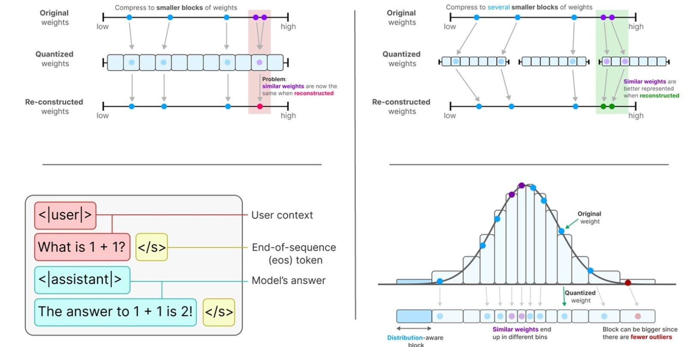

# Fine-Tuning TinyLlama with QLoRA

## Overview
This script fine-tunes the TinyLlama model using QLoRA (Quantized Low-Rank Adaptation) and PEFT (Parameter Efficient Fine-Tuning). The dataset used is "HuggingFaceH4/ultrachat_200k," and the model is configured for efficient fine-tuning using quantization techniques.

## Requirements
Ensure you have the following Python libraries installed:

```bash
pip install datasets transformers peft trl
```
## Normalized Quantization
- **Normalized Quantization:** QLoRA uses normalized quantization to quantize the low-rank matrices. This technique ensures that the quantized weights are normalized to the same scale as the original weights, preserving the model's performance during fine-tuning.




## Implementation

### 1. Load and Prepare Dataset
The script loads the `ultrachat_200k` dataset from Hugging Face and shuffles it, selecting a subset of 10,000 samples.

```python
dataset = load_dataset("HuggingFaceH4/ultrachat_200k", trust_remote_code=True, split="train_sft")
dataset = dataset.shuffle(seed=0).select(range(10_000))
print(dataset[0])
```
```sh
{'prompt': '3. Heat the vegetables in boiling water for the recommended time.', 'prompt_id': '827b4bc3c5d8646e574bd741d65f7de92057be4f1fb1a4456d5f136cf7397568', 'messages': [{'content': '3. Heat the vegetables in boiling water for the recommended time.', 'role': 'user'}, {'content': 'I do not have information about the specific type of vegetables being referred to. However, here are general instructions for boiling most vegetables:\n\n1. Wash the vegetables thoroughly with clean water.\n2. Cut the vegetables into small or medium-sized pieces.\n3. Bring a pot of water to boil on the stove.\n4. Add a pinch of salt to the boiling water.\n5. Add the vegetables to the boiling water.\n6. Cook the vegetables for the recommended time (see cooking instructions on the package or look up cooking times for specific vegetables online).\n7. Test the vegetables for doneness using a fork or a knife. They should be tender but not overcooked and mushy.\n8. Once the vegetables are cooked 
to your desired tenderness, remove them from the boiling water using a slotted spoon or a strainer.\n9. Drain the vegetables and serve hot with your favorite seasonings or sauce.', 'role': 'assistant'}, {'content': 'Can you add some information on how to prevent the vegetables from getting too soft or overcooked?', 'role': 'user'}, {'content': "Certainly, here are some tip
```
- Load the model
```python
template_tokenizer = AutoTokenizer.from_pretrained("TinyLlama/TinyLlama-1.1B-Chat-v1.0")
print(template_tokenizer)
```

```sh
LlamaTokenizerFast(name_or_path='TinyLlama/TinyLlama-1.1B-Chat-v1.0', vocab_size=32000, model_max_length=2048, is_fast=True, padding_side='right', truncation_side='right', special_tokens={'bos_token': '<s>', 'eos_token': '</s>', 'unk_token': '<unk>', 'pad_token': '</s>'}, clean_up_tokenization_spaces=False, added_tokens_decoder={
        0: AddedToken("<unk>", rstrip=False, lstrip=False, single_word=False, normalized=False, special=True),
        1: AddedToken("<s>", rstrip=False, lstrip=False, single_word=False, normalized=False, special=True),
        2: AddedToken("</s>", rstrip=False, lstrip=False, single_word=False, normalized=False, special=True),
}
)
```

It also defines a function `format_prompt()` to structure chat messages into the expected format:

```python
def format_prompt(example):
    chat = example['messages']
    prompt = template_tokenizer.apply_chat_template(chat, tokenize=False)
    return {'text': prompt}
print(format_prompt(dataset[0])['text'])
#dataset = dataset.map(format_prompt)
```
```sh
3. Heat the vegetables in boiling water for the recommended time.</s>
<|assistant|>
I do not have information about the specific type of vegetables being referred to. However, here are general instructions for boiling most vegetables:

1. Wash the vegetables thoroughly with clean water.
2. Cut the vegetables into small or medium-sized pieces.
3. Bring a pot of water to boil on the stove.
4. Add a pinch of salt to the boiling water.
5. Add the vegetables to the boiling water.
6. Cook the vegetables for the recommended time (see cooking instructions on the package or look up cooking times for specific vegetables online).
7. Test the vegetables for doneness using a fork or a knife. They should be tender but not overcooked and mushy.
8. Once the vegetables are cooked to your desired tenderness, remove them from the boiling water using a slotted spoon or a strainer.
9. Drain the vegetables and serve hot with your favorite seasonings or sauce.</s>
<|user|>
Can you add some information on how to prevent the vegetables from getting too soft or overcooked?</s>
<|assistant|>
Certainly, here are some tips to prevent vegetables from getting too soft or overcooked:
```

### 2. Test the Base Model
A pre-trained TinyLlama model is loaded for testing before fine-tuning:

```python
model_name = "TinyLlama/TinyLlama-1.1B-intermediate-step-1431k-3T"
pipe = pipeline(task='text-generation', model=model_name, device='cuda')
output = pipe("Tell me something about Large Language Models.")
print(output)
```

### 3. Configure Quantization
To optimize memory usage, 4-bit quantization is applied using `BitsAndBytesConfig`:

```python
bnb_config = BitsAndBytesConfig(
    load_in_4bit=True,
    bnb_4bit_quant_type="nf4",
    bnb_4bit_compute_dtype='float16',
    bnb_4bit_use_double_quant=True
)
```

The model and tokenizer are loaded with this configuration:

```python
model = AutoModelForCausalLM.from_pretrained(
    model_name,
    device_map="auto",
    quantization_config=bnb_config
)
```

### 4. Set Up LoRA Configuration
LoRA (Low-Rank Adaptation) is used to fine-tune only specific layers of the model:

```python
peft_config = LoraConfig(
    lora_alpha=32,
    lora_dropout=0.1,
    r=64,
    bias='none',
    task_type='CAUSAL_LM',
    target_modules=['q_proj', 'k_proj', 'v_proj', 'o_proj', 'gate_proj', 'up_proj', 'down_proj']
)
```

The model is then prepared for fine-tuning:

```python
model = prepare_model_for_kbit_training(model)
model = get_peft_model(model, peft_config)
```

### 5. Train the Model
The training arguments are configured:

```python
args = TrainingArguments(
    output_dir="train_dir",
    per_device_train_batch_size=2,
    gradient_accumulation_steps=4,
    optim="paged_adamw_32bit",
    learning_rate=2e-4,
    lr_scheduler_type="cosine",
    num_train_epochs=1,
    logging_steps=10,
    fp16=True,
    gradient_checkpointing=True
)
```

The model is then trained using `SFTTrainer`:

```python
trainer = SFTTrainer(
    model=model,
    train_dataset=dataset,
    dataset_text_field='text',
    tokenizer=tokenizer,
    args=args,
    max_seq_length=512,
    peft_config=peft_config
)

trainer.train()
trainer.model.save_pretrained("TinyLlama-1.1B-qlora")
```

### 6. Load Fine-Tuned Model for Predictions
Once training is complete, the fine-tuned model is loaded for inference:

```python
model = AutoPeftModelForCausalLM.from_pretrained("TinyLlama-1.1B-qlora", device_map='auto')
merged_model = model.merge_and_unload()
```

A new pipeline is created for text generation:

```python
pipe = pipeline(task='text-generation', model=merged_model, tokenizer=tokenizer)
output = pipe("Tell me something about Large Language Models.")
print(output[0]['generated_text'])
```

### 7. Save the Trained Model
Finally, the fine-tuned model is compressed into a ZIP file:

```bash
zip -r tiny_llama_qlora_adapter.zip TinyLlama-1.1B-qlora
```

## Conclusion
This script successfully fine-tunes a TinyLlama model using LoRA and quantization techniques to reduce computational cost while maintaining performance. The fine-tuned model can be used for inference with significantly lower resource consumption.

